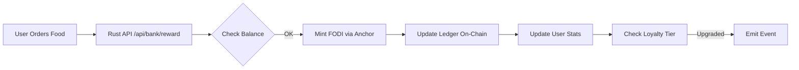
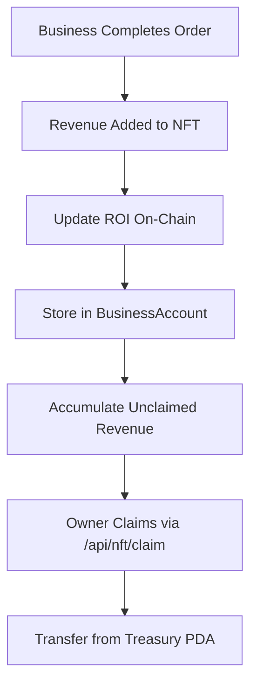

# 🚀 FODI Ecosystem: Complete On-Chain Integration

## 📊 System Architecture

```
┌─────────────────────────────────────────────────────────────────┐
│                     FODI ECOSYSTEM v3.0                          │
├─────────────────────────────────────────────────────────────────┤
│                                                                  │
│  ┌──────────────┐    ┌──────────────┐    ┌──────────────┐     │
│  │  Rust API    │────│ FODI Bank    │────│ Solana       │     │
│  │  (Axum)      │    │  (Anchor)    │    │  Devnet      │     │
│  └──────────────┘    └──────────────┘    └──────────────┘     │
│         │                    │                    │             │
│         ▼                    ▼                    ▼             │
│  ┌──────────────┐    ┌──────────────┐    ┌──────────────┐     │
│  │  Bank API    │    │  Reward      │    │  Treasury    │     │
│  │  /api/bank/* │    │  Ledger      │    │  PDA         │     │
│  └──────────────┘    └──────────────┘    └──────────────┘     │
│         │                    │                    │             │
│         ▼                    ▼                    ▼             │
│  ┌──────────────┐    ┌──────────────┐    ┌──────────────┐     │
│  │  NFT API     │────│  Business    │────│  NFT Mint    │     │
│  │  /api/nft/*  │    │  Account     │    │  Metadata    │     │
│  └──────────────┘    └──────────────┘    └──────────────┘     │
│         │                    │                    │             │
│         ▼                    ▼                    ▼             │
│  ┌──────────────────────────────────────────────────────┐      │
│  │          USERS & BUSINESSES (Wallets)                 │      │
│  └──────────────────────────────────────────────────────┘      │
│                                                                  │
└─────────────────────────────────────────────────────────────────┘
```

---

## 🎯 Key Features

### 1. **Off-Chain → On-Chain Flow**



### 2. **Business Revenue Flow**



---

## 🛠️ Implementation Guide

### Step 1: Deploy FODI Bank Program

```bash
cd /Users/dmitrijfomin/Desktop/bot_fodifood

# Build Anchor program
anchor build

# Deploy to devnet
anchor deploy --provider.cluster devnet

# Get program ID
solana program show FoDiBANK11111111111111111111111111111111111
```

### Step 2: Initialize Bank

```bash
# Run initialization script
ts-node scripts/initialize-bank.ts

# Or via Rust API
curl -X POST http://127.0.0.1:8000/api/bank/init \
  -H "Authorization: Bearer ADMIN_TOKEN"
```

**What happens:**
- Creates `BankConfig` PDA
- Creates `treasury` token account PDA
- Sets up treasury authority PDA
- Links FODI mint

### Step 3: Integrate Rust API → Anchor

Update `src/bank/api.rs`:

```rust
use anchor_client::{Client, Cluster, Program};

/// Reward user with FODI tokens (on-chain via Anchor)
async fn reward_user_onchain(
    user_id: String,
    amount: u64,
    reason: String,
) -> Result<String, Error> {
    // 1. Get user's Solana wallet from database
    let wallet = wallet_db.get(&user_id)?;
    
    // 2. Initialize Anchor client
    let payer = read_keypair_file(TREASURY_KEYPAIR)?;
    let client = Client::new(Cluster::Devnet, Rc::new(payer));
    let program = client.program(FODI_BANK_PROGRAM_ID)?;
    
    // 3. Derive PDAs
    let (bank_config, _) = Pubkey::find_program_address(
        &[b"bank_config"],
        &program.id(),
    );
    
    let (user_rewards, _) = Pubkey::find_program_address(
        &[b"user_rewards", wallet.pubkey.as_ref()],
        &program.id(),
    );
    
    // 4. Call reward instruction
    let tx = program
        .request()
        .accounts(fodi_bank::accounts::Reward {
            bank_config,
            treasury,
            fodi_mint,
            user_token_account: wallet.ata,
            user_rewards,
            ledger_entry,
            authority: payer.pubkey(),
            // ... other accounts
        })
        .args(fodi_bank::instruction::Reward {
            amount,
            reward_type: RewardType::OrderReward,
            reason,
        })
        .send()?;
    
    Ok(tx.to_string())
}
```

### Step 4: Link NFTs to Business Accounts

```rust
/// Create business account when minting NFT
async fn mint_business_nft_with_account(
    owner: Pubkey,
    business_name: String,
) -> Result<(String, String), Error> {
    // 1. Mint NFT via Metaplex
    let nft_mint = mint_nft(owner, business_name).await?;
    
    // 2. Create BusinessAccount PDA in FODI Bank
    let (business_pda, _) = Pubkey::find_program_address(
        &[b"business", nft_mint.as_ref()],
        &FODI_BANK_PROGRAM_ID,
    );
    
    // 3. Initialize business account
    program
        .request()
        .accounts(fodi_bank::accounts::InitializeBusiness {
            bank_config,
            business: business_pda,
            nft_mint,
            owner,
            // ...
        })
        .args(fodi_bank::instruction::InitializeBusiness {
            // ...
        })
        .send()?;
    
    Ok((nft_mint.to_string(), business_pda.to_string()))
}
```

---

## 📡 API Endpoints

### Bank Module

| Method | Endpoint | Description |
|--------|----------|-------------|
| POST | `/api/bank/reward` | Reward user (off-chain ledger) |
| POST | `/api/bank/reward/onchain` | **NEW**: Mint FODI via Anchor |
| GET | `/api/bank/balance/{user_id}` | Get balance |
| GET | `/api/bank/ledger/{user_id}` | **NEW**: Query on-chain ledger |
| GET | `/api/bank/stats` | Global bank statistics |

### NFT Module

| Method | Endpoint | Description |
|--------|----------|-------------|
| POST | `/api/nft/mint` | Mint business NFT |
| POST | `/api/nft/update/roi` | **NEW**: Update ROI on-chain |
| POST | `/api/nft/claim` | **NEW**: Claim business revenue |
| GET | `/api/nft/stats/{nft_mint}` | **NEW**: Query on-chain business stats |
| GET | `/api/nft/marketplace` | List all NFTs |

---

## 🔄 Data Flow Examples

### Example 1: User Places Order

```bash
# 1. User places order via REST API
curl -X POST http://127.0.0.1:8000/api/v1/orders \
  -d '{"user_id": "alice", "items": [...], "total": 45.50}'

# 2. Backend processes order → triggers reward
# Internal: POST /api/bank/reward/onchain

# 3. Anchor program:
#    - Mints 5 FODI to Alice's wallet
#    - Creates LedgerEntry on-chain
#    - Updates UserRewardAccount
#    - Checks loyalty tier (auto-upgrade if earned 100+ FODI)

# 4. Response:
{
  "order_id": "ord_12345",
  "fodi_earned": 5.0,
  "tx_signature": "3xK9...",
  "loyalty_tier": 2
}
```

### Example 2: Update Business ROI

```bash
# 1. Admin calculates business performance
curl -X POST http://127.0.0.1:8000/api/nft/update/roi \
  -H "Authorization: Bearer ADMIN_TOKEN" \
  -d '{
    "nft_mint": "BobsRestaurantNFT...",
    "roi": 850,
    "revenue": 25000000000
  }'

# 2. Rust backend calls Anchor:
#    update_business_roi(nft_mint, 850bps, 25 FODI)

# 3. On-chain state updated:
#    BusinessAccount {
#      roi: 850,            # 8.5%
#      total_revenue: 125000000000,
#      unclaimed_revenue: 25000000000,
#      total_orders: 142,
#    }

# 4. NFT metadata updated (via Metaplex CPI)
#    attributes: [
#      { "trait_type": "ROI", "value": "8.5%" },
#      { "trait_type": "Revenue", "value": "125 FODI" },
#    ]
```

### Example 3: Business Owner Claims Revenue

```bash
# 1. Owner checks unclaimed revenue
curl http://127.0.0.1:8000/api/nft/stats/BobsRestaurantNFT...

# Response:
{
  "unclaimed_revenue": 25000000000,  # 25 FODI
  "roi": 8.5,
  "total_orders": 142
}

# 2. Owner claims revenue
curl -X POST http://127.0.0.1:8000/api/nft/claim \
  -H "Authorization: Bearer OWNER_SIGNATURE" \
  -d '{"nft_mint": "BobsRestaurantNFT..."}'

# 3. Anchor program:
#    - Transfers 25 FODI from treasury to owner's ATA
#    - Resets unclaimed_revenue to 0
#    - Emits ClaimEvent

# 4. Owner's wallet receives 25 FODI
```

---

## 🔐 Security Model

### Admin Authority

**Powers:**
- Initialize bank
- Mint rewards
- Freeze accounts
- Burn tokens
- Update business ROI (admin override)

**Keypair:** `~/.config/solana/id.json` (NEVER commit!)

### Business Owners

**Powers:**
- Claim their own revenue
- Update their own business ROI (if enabled)
- View business stats

**Verification:** NFT ownership + signature

### Users

**Powers:**
- Receive rewards
- Spend FODI
- View ledger history
- Earn loyalty tiers

**Verification:** Wallet signature

---

## 📊 On-Chain Data Queries

### Query User Reward History

```typescript
// Get all ledger entries for a user
const program = await Program.at(FODI_BANK_ID, provider);

const entries = await program.account.ledgerEntry.all([
  {
    memcmp: {
      offset: 8,
      bytes: userPubkey.toBase58(),
    }
  }
]);

console.log("Total rewards:", entries.length);
console.log("Total earned:", entries.reduce((sum, e) => sum + e.account.amount, 0));
```

### Query Business Performance

```typescript
const [businessPDA] = PublicKey.findProgramAddressSync(
  [Buffer.from("business"), nftMint.toBuffer()],
  program.programId
);

const business = await program.account.businessAccount.fetch(businessPDA);

console.log(`ROI: ${business.roi / 100}%`);
console.log(`Revenue: ${business.totalRevenue / 1e9} FODI`);
console.log(`Orders: ${business.totalOrders}`);
console.log(`Unclaimed: ${business.unclaimedRevenue / 1e9} FODI`);
```

---

## 🚀 Deployment Checklist

### Prerequisites

- [x] Rust installed
- [x] Anchor CLI 0.30.1
- [x] Solana CLI 1.18+
- [x] Node.js 18+ (for tests)
- [x] Treasury wallet with SOL

### Deployment Steps

```bash
# 1. Set Solana to devnet
solana config set --url devnet

# 2. Airdrop SOL to treasury (devnet only)
solana airdrop 2 ~/.config/solana/id.json --url devnet

# 3. Build Anchor program
cd /Users/dmitrijfomin/Desktop/bot_fodifood
anchor build

# 4. Deploy
anchor deploy --provider.cluster devnet

# 5. Initialize bank
ts-node scripts/initialize-bank.ts

# 6. Update .env with program ID
echo "FODI_BANK_PROGRAM_ID=<DEPLOYED_ID>" >> .env

# 7. Restart Rust API
pkill -f "target/debug/local"
cargo run --bin local

# 8. Test reward flow
curl -X POST http://127.0.0.1:8000/api/bank/reward/onchain \
  -d '{"user_id": "alice", "amount": 5000000000, "reason": "Test"}'

# 9. Verify on explorer
https://explorer.solana.com/tx/<TX_SIGNATURE>?cluster=devnet
```

---

## 📈 Future Enhancements

### Phase 1: Core Integration ✅
- [x] FODI Bank Anchor program
- [x] Reward distribution on-chain
- [x] Business ROI tracking
- [x] Revenue claiming
- [ ] **NEXT**: Integrate with Rust API

### Phase 2: NFT Metadata 🔜
- [ ] Metaplex CPI in Anchor
- [ ] Store ROI in NFT attributes
- [ ] Dynamic NFT images based on performance
- [ ] Business badges (verified, top-rated, etc.)

### Phase 3: Advanced Tokenomics 🔜
- [ ] Staking rewards (lock FODI, earn APY)
- [ ] Governance voting (1 FODI = 1 vote)
- [ ] Buyback and burn mechanism
- [ ] Referral program on-chain

### Phase 4: Analytics Dashboard 🔜
- [ ] Real-time on-chain data
- [ ] Business leaderboard
- [ ] User loyalty tiers visualization
- [ ] Transaction explorer

---

## 🐛 Troubleshooting

### Issue: "Account not found"

**Cause:** PDA not initialized yet

**Fix:**
```bash
# Re-run initialization
ts-node scripts/initialize-bank.ts
```

### Issue: "Insufficient treasury balance"

**Cause:** Treasury doesn't have FODI to mint/transfer

**Fix:**
```bash
# Mint FODI to treasury
spl-token mint <FODI_MINT> 10000 <TREASURY_ATA> --url devnet
```

### Issue: "Unauthorized"

**Cause:** Wrong admin keypair or wallet

**Fix:**
```bash
# Verify authority matches
solana address  # Should match BankConfig.authority
```

---

## 📚 References

- **Anchor Docs**: https://www.anchor-lang.com
- **Solana Cookbook**: https://solanacookbook.com
- **Metaplex Docs**: https://docs.metaplex.com
- **SPL Token**: https://spl.solana.com/token

---

**Version:** 3.0.0  
**Status:** 🟡 Development (Anchor program ready, Rust integration pending)  
**Next Steps:** Connect Rust API → Anchor program for live rewards
